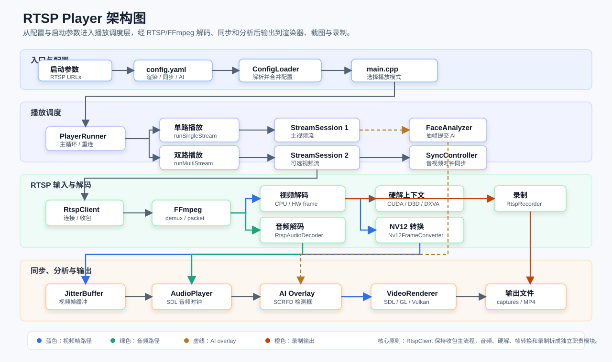

# RTSP Player

Windows RTSP 播放器，基于 FFmpeg 解码，支持 SDL/OpenGL/Vulkan 渲染、音频播放、音视频同步、断线重连、截图录制、多路网格显示和 SCRFD ONNX 人脸检测 overlay。

## 功能特性

- RTSP over TCP/UDP，支持低延迟连接参数。
- SDL、OpenGL、Vulkan 三种渲染后端。
- NV12 渲染路径，OpenGL/Vulkan 保持视频宽高比。
- 可选 NVIDIA NVDEC/CUDA 硬解，失败时回退到 d3d11va/dxva2 或软件解码。
- 音频解码、48 kHz stereo S16 重采样和 SDL 播放。
- 以音频时钟为主的音视频同步、jitter buffer 和晚帧丢弃。
- 多路 RTSP 网格显示，单路断开后自动隐藏并后台重连。
- 截图、录制、运行时滤镜切换。
- SCRFD ONNX 人脸检测，支持 ONNX Runtime CPU/CUDA provider。
- 本机摄像头 MediaMTX + FFmpeg 推流辅助脚本。

## 架构概览



核心边界：

- `PlayerRunner` 负责单路/多路播放主循环、重连，并执行同步模块返回的等待、渲染或等待新帧决策。
- `sync_controller.cpp` 集中实现单路/多路同步策略、音频预缓冲与时钟、视频时间戳修正和 jitter buffer 自适应延迟/释放时序；各流的时序状态独立维护。
- `AudioPlayer` 负责 SDL 音频设备和队列操作，`JitterBuffer` 负责帧队列、排序、容量限制与线程安全，二者调用同步模块做时序判断。
- `StreamSession` 封装单路流状态，把 `RtspClient` 输出的视频帧推入 `JitterBuffer`，把音频帧转给 `AudioPlayer`。
- `RtspClient` 负责 RTSP 连接和收包主循环；音频解码、硬解上下文、NV12 转换和录制分别由独立模块承载。
- `VideoRenderer` 是渲染后端接口，SDL/OpenGL/Vulkan 共享播放状态和 overlay 输入。

## 环境要求

- Windows 10/11
- Visual Studio 2022 C++ toolchain
- CMake 3.21 或更新版本
- vcpkg
- Vulkan SDK 或可用的 Vulkan loader/runtime
- 可选：NVIDIA GPU、CUDA Toolkit、cuDNN、带 `nvcodec` feature 的 FFmpeg

项目依赖由 [vcpkg.json](vcpkg.json) 管理。确保 `vcpkg` 已在 `PATH` 中，或设置了 `VCPKG_ROOT`：

```powershell
$env:VCPKG_ROOT = "E:\vcpkg"
```

## 构建

推荐使用项目脚本：

```powershell
.\scripts\build.ps1
```

只重新构建，不重新配置：

```powershell
.\scripts\build.ps1 -SkipConfigure
```

也可以直接使用 CMake presets：

```powershell
cmake --preset windows-vcpkg
cmake --build --preset windows-vcpkg-release
ctest --preset windows-vcpkg-release
```

Debug 构建：

```powershell
cmake --build --preset windows-vcpkg-debug
```

如果 `build-vcpkg` 是在加入 `vcpkg.json` 之前生成的，vcpkg 不能把该目录原地切换到 manifest mode。删除 `build-vcpkg` 后重新运行 `.\scripts\build.ps1`，即可使用 `vcpkg.json` 自动恢复依赖。

## 启用 CUDA/NVDEC

Windows/vcpkg 构建需要 FFmpeg 的 `nvcodec` feature，否则 `h264_cuvid` 等 CUDA decoder 不会出现在播放器实际加载的 `avcodec-*.dll` 中。

```powershell
.\scripts\build.ps1 -EnableCudaFfmpeg
```

然后在 [config/config.yaml](config/config.yaml) 中启用：

```yaml
hw_decode: "cuda"
```

播放器会优先尝试 CUDA，失败时自动尝试 d3d11va/dxva2，再回退到软件解码。启动后可在日志中确认：

```text
Selected hardware decoder: h264_cuvid
Hardware decode active: cuda
```

## 运行

使用配置文件中的默认 RTSP 地址启动：

```powershell
.\build-vcpkg\bin\Release\rtsp_player.exe
```

启动时传入单路 RTSP 地址：

```powershell
.\build-vcpkg\bin\Release\rtsp_player.exe rtsp://你的摄像头IP:554/你的路径
```

启动时传入多路 RTSP 地址：

```powershell
.\build-vcpkg\bin\Release\rtsp_player.exe rtsp://第一个摄像头IP:554/你的路径 rtsp://第二个摄像头IP:554/你的路径 rtsp://第三个摄像头IP:554/你的路径
```

命令行会读取所有传入的 RTSP URL。实际启用路数由 `multi_stream.max_streams` 限制。

命令行全局覆盖人脸识别开关：

```powershell
.\build-vcpkg\bin\Release\rtsp_player.exe --face-detection off rtsp://127.0.0.1:8554/webcam rtsp://127.0.0.1:8554/sample
.\build-vcpkg\bin\Release\rtsp_player.exe --face-detection on
```

## 配置

主要配置位于 [config/config.yaml](config/config.yaml)。

### 渲染后端

```yaml
renderer: "vulkan" # sdl, opengl, vulkan
```

Vulkan 后端支持 CPU NV12 帧上传和 shader 转 RGB。启用 CUDA 硬解时，Vulkan 会尝试通过 CUDA/Vulkan external memory buffer 在 GPU 侧拷贝 NV12 平面，再拷入现有 Y/UV 采样纹理。OpenGL/Vulkan 双路显示均支持 `CUDA_NV12` 帧。

### RTSP 连接

```yaml
rtsp:
  transport: "tcp"        # tcp 或 udp
  timeout_ms: 5000        # 连接和读写超时
  buffer_size: 262144     # FFmpeg 输入缓冲区
  low_latency:
    enabled: true
    max_delay_ms: 50
    analyze_duration_ms: 0
    probe_size_bytes: 32768
    reorder_queue_size: 0
```

### 音频与同步

```yaml
audio:
  enabled: true
  target_latency_ms: 30
  max_queue_ms: 300
  hard_reset_queue_ms: 1500

sync:
  enabled: true
  mode: timestamp  # timestamp 或 receive_time
  max_wait_ms: 16
  late_drop_ms: 250
  audio_offset_ms: 0
```

默认 `mode: timestamp`：从 FFmpeg 包的 PRFT（由 RTCP Sender Report 映射得到的 Unix 时间）建立每路原始 PTS 到共同时间的映射，随解码帧保留；所有有映射的视频流都与音频实际队列头的共同时间比较。视频超前会等待，落后超过 `late_drop_ms` 会丢帧追赶，某一路等待时其他路仍可更新。音频重采样会扣除缓冲样本对应的时长，音频重连/队列硬重置与视频重连都会清除旧时序状态。

时间戳模式不使用 `audio_offset_ms`，无需沿用原有的 700 ms 固定补偿。缺少任一侧的共同时间映射时，多路视频独立显示；日志中的 `sender clock mapped from RTCP/PRFT` 表示取得映射，`timestamp A/V sync active` 和 overlay 的 `AV DIFF ... TS` 表示正在使用共同时间同步。同步精度取决于源端/服务器的 RTCP 时钟映射是否准确代表媒体采集时刻，接收时间不能替代采集时间。

`mode: receive_time` 保留旧的多路延迟补偿模式，仅第一路视频按“接收时间 + 音频目标延迟 + `audio_offset_ms`”调度；正偏移让视频晚显示，合计延迟最低为 0。单路在共同时间可用时也使用时间戳同步，否则继续按相对 PTS/音频时钟或本地单调时钟调度。

从项目根目录启动双摄像头和独立音频（`audio.enabled: true`，`audio_rtsp_url: rtsp://127.0.0.1:8554/audio`）：

```powershell
.\scripts\start_webcam_rtsp.ps1 -Dual
.\build-vcpkg\bin\Release\rtsp_player.exe --timestamp-sync rtsp://127.0.0.1:8554/webcam rtsp://127.0.0.1:8554/webcam2
```

`--timestamp-sync` 只为本次启动启用时间戳同步，无需修改配置中标记为手工修改的同步开关。

### Jitter Buffer

```yaml
jitter_buffer:
  max_size: 40
  latency_ms: 50
  adaptive: true
  max_latency_ms: 200
```

`latency_ms` 是基础等待时间；自适应模式根据帧到达间隔与显示时间戳间隔的偏差提高等待时间，上限为 `max_latency_ms`。设置 `adaptive: false` 可使用固定延迟。低延迟场景可降低基础值；弱网时可适当提高基础值与上限，并配合调整 `audio.target_latency_ms`。缓冲区按已解码帧的显示时间戳做有限重排，超过等待窗口才到达的旧帧会丢弃。

### 多路网格

```yaml
renderer: "vulkan"
width: 1280
height: 720
multi_stream:
  max_streams: 40
rtsp_urls:
  - "rtsp://第一个摄像头IP:554/你的路径"
  - "rtsp://第二个摄像头IP:554/你的路径"
  - "rtsp://第三个摄像头IP:554/你的路径"
```

`width` / `height` 是播放器窗口尺寸；多路网格会整体适配到这个窗口内。40 路预览建议先用 `1280x720` 或 `1600x900`，不要按每路源分辨率放大窗口。

多路本机推流时，音频可以单独走一路 RTSP，避免拖慢第一路视频：

```yaml
rtsp_urls:
  - "rtsp://127.0.0.1:8554/webcam"
  - "rtsp://127.0.0.1:8554/webcam2"
audio_rtsp_url: "rtsp://127.0.0.1:8554/audio"
```

### OpenGL 滤镜

```yaml
opengl_filters:
  - warm
  - contrast
```

可选值：`none`、`grayscale`、`warm`、`invert`、`contrast`、`saturation`。OpenGL 和 Vulkan 运行时都可以按 `F` 切换单滤镜预览。

### 断线重连

```yaml
reconnect:
  enabled: true
  initial_delay_ms: 1000
  max_delay_ms: 5000
```

## 人脸检测

启用 SCRFD ONNX 后端：

```yaml
face_detection:
  enabled: true
  backend: "onnx_cuda" # onnx_cpu, onnx_cuda, tensorrt
  model: "models/det_500m.onnx"
  input_width: 640
  input_height: 640
  detect_every_n_frames: 5
  score_threshold: 0.5
  nms_threshold: 0.4
```

`onnx_cuda` 会先检查 ONNX Runtime 的 `CUDAExecutionProvider`。可用时使用 GPU 推理；不可用、初始化失败或缺少 provider DLL 时记录 warning 并自动回退到 `onnx_cpu`。

多路播放时，人脸识别是全局开关，一次作用于所有路：

```powershell
.\build-vcpkg\bin\Release\rtsp_player.exe --face-detection off
.\build-vcpkg\bin\Release\rtsp_player.exe --face-detection on
```

检查 ONNX Runtime CUDA provider：

```powershell
cmake --build build-vcpkg --config Release --target onnx_cuda_probe
$env:Path = "C:\Program Files\NVIDIA GPU Computing Toolkit\CUDA\v13.2\bin\x64;C:\Program Files\NVIDIA\CUDNN\v9.22\bin\13.2\x64;$env:Path"
.\build-vcpkg\bin\Release\onnx_cuda_probe.exe models\det_500m.onnx
```

成功时会看到：

```text
available_providers=CUDAExecutionProvider,CPUExecutionProvider
cuda_session=ok
```

Windows 下需要确保 `onnxruntime_providers_cuda.dll`、`onnxruntime_providers_shared.dll` 以及匹配的 CUDA/cuDNN 运行库能被 exe 找到。

## 本机摄像头 RTSP 推流

辅助脚本假设 MediaMTX 位于仓库同级目录的 `..\mediamtx`。

启动本机摄像头 RTSP 流：

```powershell
.\scripts\start_webcam_rtsp.ps1
```

关闭音频：

```powershell
.\scripts\start_webcam_rtsp.ps1 -NoAudio
```

同时推送内置摄像头和第二个 USB 摄像头：

```powershell
.\scripts\start_webcam_rtsp.ps1 -Dual
```

指定第二个摄像头设备名：

```powershell
.\scripts\start_webcam_rtsp.ps1 -Dual -SecondCameraName "Logi C270 HD WebCam"
```

如果启动双路但第二个摄像头未插入，脚本会先按单路推流，并启动后台 watcher 等待第二摄像头；第二摄像头恢复后会自动推送到 `webcam2`。

停止本机摄像头 RTSP 流：

```powershell
.\scripts\stop_webcam_rtsp.ps1
```

## 40 路本机压测链路

这条链路用于本机压测：第 1 路使用本机摄像头推到 `rtsp://127.0.0.1:8554/webcam`，第 2-40 路复用同一个 MP4 循环推出来的 `rtsp://127.0.0.1:8554/sample`。默认 MP4 路径是 `captures\recording_20260507_155110_304.mp4`。

1. 构建播放器：

```powershell
cmake --build --preset windows-vcpkg-release --target rtsp_player
```

1. 启动 MediaMTX、摄像头推流、MP4 循环推流，并直接启动播放器：

```powershell
.\scripts\start_16_streams.ps1 -StartPlayer -FaceDetection off
```

1. 如果只启动 RTSP 源，不启动播放器：

```powershell
.\scripts\start_16_streams.ps1 -FaceDetection off
.\build-vcpkg\bin\Release\rtsp_player.exe --face-detection off
```

1. 开启人脸识别进行全路测试：

```powershell
.\scripts\start_16_streams.ps1 -StartPlayer -FaceDetection on
```

1. 停止整条链路：

```powershell
Get-Process rtsp_player -ErrorAction SilentlyContinue | Stop-Process -Force
.\scripts\stop_webcam_rtsp.ps1
```

可选参数：

- `-StreamCount 40`：设置总路数，第 1 路是摄像头，其余路复用 MP4 RTSP。
- `-FaceDetection off|on|config`：启动播放器时覆盖人脸识别开关；`config` 表示使用 `config/config.yaml`。
- `-Mp4Path "C:\path\to\video.mp4"`：指定用于重复推流的 MP4。
- `-TranscodeFile`：MP4 无法 `-c:v copy` 推流时才启用转码，CPU 消耗更高。

## 快捷键

| 按键 | 功能 |
| --- | --- |
| `F` | 切换单滤镜预览 |
| `S` | 保存当前最终画面截图到 `captures/` |
| `R` | 开始/停止录制，输出到 `captures/` |
| `ESC` / `Q` | 退出 |

## 输出目录

- `captures/`：截图和录制文件
- `logs/`：运行日志
- `build-vcpkg/`：CMake 构建目录

这些目录默认被 `.gitignore` 忽略。

## 开发与测试

运行单元测试：

```powershell
ctest --preset windows-vcpkg-release
```

验证三路独立 RTSP 的共同时间同步（隔离端口 18554，使用两路合成视频、一路合成音频和 SDL 虚拟音频设备，不打开摄像头或播放声音）：

```powershell
.\scripts\test_timestamp_sync.ps1
```

脚本会构建 `rtsp_sync_probe`，检查实际解复用/解码后的参考时间、44.1 kHz 音频转 48 kHz 后的时序与第二路重连后重新建立映射，结束时停止它启动的测试服务和推流进程。运行日志位于 `build-vcpkg/sync-integration`。

构建 ONNX CUDA provider 探针：

```powershell
cmake --build build-vcpkg --config Release --target onnx_cuda_probe
```

主要代码结构：

- `src/rtsp_client.cpp`：RTSP 输入、FFmpeg 解复用、音视频解码、硬解回退和录制。
- `src/player_runner.cpp`：单路/多路播放主循环、同步决策执行、重连和渲染调度。
- `src/sync_controller.cpp`：单路/多路同步决策、音频时钟与预缓冲、视频时间戳修正、jitter buffer 时序策略。
- `src/audio_player.cpp` / `src/jitter_buffer.cpp`：音频设备和帧队列操作，调用同步模块的时序策略。
- `src/rendering/`：SDL、OpenGL、Vulkan 渲染后端。
- `src/onnx_scrfd_detector.cpp`：SCRFD ONNX 推理与后处理。
- `tests/unit_tests.cpp`：配置、jitter buffer 和同步逻辑测试。


作者一般运行流程：

```powershell

cmake --preset windows-vcpkg
.\scripts\start_16_streams.ps1 -StartPlayer -FaceDetection off
.\scripts\stop_webcam_rtsp.ps1

```
